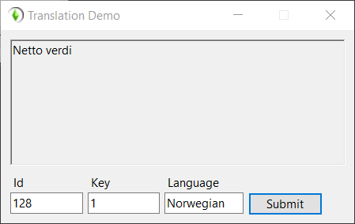

# SimTactics Translation Demo

This a basic demo for testing [TSO Translations](https://github.com/simtactics/tsotranslation).

## Screenshot

## Requirements
### Prerequisites

- [.NET](https://dotnet.microsoft.com/download) 5+ or Core 3.1

## License

I license this project under the MPL-2.0 license - see [LICENSE](LICENSE) for details.